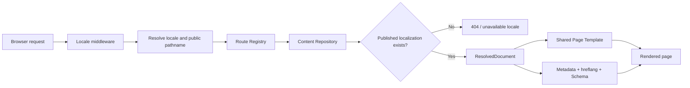
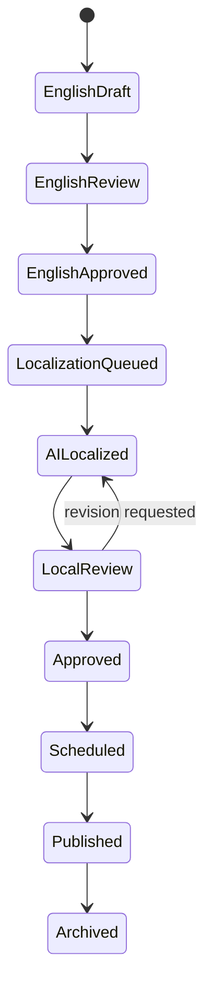

# ChinaFreeWeight 国际化架构方案

状态：Architecture Only，等待确认

适用项目：ChinaFreeWeight / Next.js App Router

本阶段范围：仅架构设计，不实现路由、不生成翻译、不修改英文页面、不部署

## 1. 架构目标

建立一套可支持 20+ 语言的统一国际化底座，并满足以下约束：

- 所有语言共享同一套 App Router 页面模板。
- 默认英语 URL 保持现状，不增加 `/en` 前缀。
- 非默认语言使用 locale 前缀，例如 `/pt/products/...`。
- Product、Blog、Case、Landing Page、FAQ、Metadata 与 Schema 从统一内容层读取。
- 新增内容实体时只写数据，不新增页面代码。
- 新增语言时只登记 locale 与内容版本，不复制页面目录。
- 未审核、未发布的语言版本不产生可索引 URL，也不进入 hreflang 或 sitemap。
- 语言切换基于“同一内容实体的路由映射”，保持当前页面语义与路径。
- 内容发布控制面与网站运行时分离，未来 SEO Control Center 不侵入页面模板。

## 2. 关键架构决策

### ADR-001：采用 `next-intl` 作为 App Router 国际化运行层

目标实现阶段选用 `next-intl`，原因如下：

- 原生支持 App Router、Server Components、Metadata 与 Middleware。
- 支持默认语言不加前缀的 `localePrefix: "as-needed"`。
- 支持服务端 message 加载，避免所有语言包进入客户端。
- 支持 pathname 映射，可用于保持页面语义的语言切换。
- Locale、方向、格式化与请求上下文可以统一管理。

本阶段不安装该依赖，也不写运行代码。

### ADR-002：采用单一 `[locale]` 路由树

目标结构中只有一套页面模板：

```text
app/[locale]/...
```

英语外部 URL 仍保持现有分类层级，例如：

```text
/products/dumbbells/rubber-hex-dumbbells
```

请求在内部解析为英语 locale。葡语外部 URL 为：

```text
/pt/products/dumbbells/rubber-hex-dumbbells
```

禁止建立 `app/pt`、`app/es`、`app/fr` 等复制目录。

### ADR-003：内容实体与语言版本分离

每个 Product、Blog、Case 或 Landing Page 只有一个稳定实体 ID。英语源内容、语言版本、路由与发布状态分别存储。

页面身份不依赖 slug。Slug 可以本地化，但语言切换通过实体 ID 找到目标语言路径，不做脆弱的字符串替换。

### ADR-004：只为已发布语言生成页面

语言 fallback 只允许用于编辑预览或非 SEO UI 字段。公开运行时遵循：

- `published`：生成页面、canonical、hreflang、sitemap。
- `approved` 但未发布：只存在于控制面，不产生公开 URL。
- `draft`、`ai_localized`、`in_review`：不产生公开 URL。
- 缺少语言版本：返回 404，不复制英语内容到语言前缀。

此规则避免 `/pt/...` 显示英语内容造成重复收录。

### ADR-005：SEO 由集中生成器负责

页面不得各自手写 canonical、hreflang、Open Graph 或 JSON-LD。模板只提供实体数据，集中 SEO 层统一生成。

## 3. Locale Framework

### 3.1 初始 Locale Registry

```text
en  English      default, prefix: none, direction: ltr
pt  Portuguese   prefix: /pt, direction: ltr
es  Spanish      prefix: /es, direction: ltr
de  German       prefix: /de, direction: ltr
fr  French       prefix: /fr, direction: ltr
it  Italian      prefix: /it, direction: ltr
nl  Dutch        prefix: /nl, direction: ltr
ru  Russian      prefix: /ru, direction: ltr
ar  Arabic       prefix: /ar, direction: rtl
ja  Japanese     prefix: /ja, direction: ltr
ko  Korean       prefix: /ko, direction: ltr
```

Locale Registry 使用数据配置，而不是散落在组件中的常量。每个 locale 记录：

```ts
type LocaleDefinition = {
  code: string;
  hreflang: string;
  name: string;
  nativeName: string;
  direction: "ltr" | "rtl";
  enabled: boolean;
  public: boolean;
  default: boolean;
  prefix: string;
  regionTargets: string[];
  fallbackLocale: string | null;
};
```

`enabled` 表示系统支持该语言；`public` 表示该语言允许出现在公开网站和 Language Switcher。二者分离，便于先准备后发布。

### 3.2 URL 规则

| 类型 | 英语 | 葡语示例 |
|---|---|---|
| 首页 | `/` | `/pt/` |
| 产品分类 | `/products/dumbbells` | `/pt/products/dumbbells` |
| 产品详情 | `/products/dumbbells/rubber-hex-dumbbells` | `/pt/products/dumbbells/rubber-hex-dumbbells` |
| Blog Hub | `/resources` | `/pt/blog` 或路由表定义的本地路径 |
| Blog Detail | `/resources/{slug}` | `/pt/blog/{localizedSlug}` |
| Case | `/projects/{slug}` | `/pt/cases/{localizedSlug}` |
| Landing | `/manufacturer/{slug}` | `/pt/manufacturer/{localizedSlug}` |

英语现有 URL 是不可变的 SEO 主路径。非英语公共 segment 与 slug 由 Route Registry 决定。

### 3.3 路由身份

每条内容记录拥有稳定 `routeKey`：

```text
product:rubber-hex-dumbbells
blog:how-to-choose-commercial-dumbbells
case:commercial-dumbbell-zone
landing:rubber-hex-dumbbell-manufacturer
```

每个已发布语言版本拥有自己的公共路径：

```ts
type LocalizedRoute = {
  entityId: string;
  locale: string;
  publicPath: string;
  slug: string;
  status: "draft" | "approved" | "published" | "archived";
  canonical: boolean;
};
```

## 4. 目标目录结构

```text
app/
├── [locale]/
│   ├── layout.tsx
│   ├── page.tsx
│   ├── products/
│   │   ├── page.tsx
│   │   ├── [category]/page.tsx
│   │   └── [category]/[slug]/page.tsx
│   ├── blog/
│   │   ├── page.tsx
│   │   └── [slug]/page.tsx
│   ├── cases/
│   │   ├── page.tsx
│   │   └── [slug]/page.tsx
│   ├── landing/[...segments]/page.tsx
│   └── [[...segments]]/page.tsx
├── api/
├── robots.ts
└── sitemap.ts

components/
├── i18n/
│   ├── LanguageSwitcher.tsx
│   ├── LocaleLink.tsx
│   └── LocaleProvider.tsx
├── templates/
│   ├── ProductTemplate.tsx
│   ├── ProductCategoryTemplate.tsx
│   ├── BlogTemplate.tsx
│   ├── BlogIndexTemplate.tsx
│   ├── CaseTemplate.tsx
│   ├── LandingTemplate.tsx
│   └── GenericPageTemplate.tsx
└── blocks/
    ├── HeroBlock.tsx
    ├── FeatureGridBlock.tsx
    ├── SpecificationBlock.tsx
    ├── FaqBlock.tsx
    ├── GalleryBlock.tsx
    └── CtaBlock.tsx

i18n/
├── routing.ts
├── request.ts
├── navigation.ts
├── locale-registry.ts
└── generated-locales.json

lib/
├── content/
│   ├── types.ts
│   ├── repository.ts
│   ├── resolver.ts
│   ├── route-registry.ts
│   ├── validation.ts
│   └── adapters/
│       ├── filesystem.ts
│       └── control-center.ts
├── seo/
│   ├── metadata.ts
│   ├── alternates.ts
│   ├── canonical.ts
│   ├── open-graph.ts
│   ├── schema.ts
│   └── sitemap.ts
└── publishing/
    ├── states.ts
    ├── eligibility.ts
    └── events.ts

content/
├── messages/
│   └── {locale}/{namespace}.json
├── entities/
│   ├── products/
│   ├── blogs/
│   ├── cases/
│   └── landings/
└── routes/
    └── localized-routes.json

middleware.ts
```

目录是目标状态，不在本阶段创建。

`app/[locale]/layout.tsx` 作为所有页面的根布局并负责输出 `<html lang>` 与 `dir`；不再保留另一个会固定语言属性的顶层 `app/layout.tsx`。默认英语无前缀仅是外部 URL 规则，middleware 会在内部将请求解析到同一 `[locale]` 路由树。

## 5. 统一内容模型

### 5.1 基础实体

```ts
type ContentKind =
  | "home"
  | "product"
  | "product_category"
  | "blog"
  | "blog_index"
  | "case"
  | "case_index"
  | "landing"
  | "factory"
  | "generic";

type ContentEntity = {
  id: string;
  kind: ContentKind;
  templateKey: string;
  sourceLocale: "en";
  businessData: Record<string, unknown>;
  media: MediaReference[];
  relations: ContentRelation[];
  createdAt: string;
  updatedAt: string;
};
```

`businessData` 保存不需要翻译的事实，例如尺寸、重量、材料代码、图片引用和产品关系。

### 5.2 语言版本

```ts
type LocalizationStatus =
  | "missing"
  | "draft"
  | "ai_localized"
  | "in_review"
  | "approved"
  | "scheduled"
  | "published"
  | "archived";

type LocalizedDocument = {
  entityId: string;
  locale: string;
  status: LocalizationStatus;
  version: number;
  route: LocalizedRoute;
  title: string;
  summary?: string;
  blocks: ContentBlock[];
  faq: FaqItem[];
  seo: SeoFields;
  author?: AuthorReference;
  categoryIds: string[];
  reviewer?: string;
  reviewedAt?: string;
  publishedAt?: string;
};
```

### 5.3 内容 Block

页面正文由可组合 Block 构成，所有语言共享 Block 类型和模板：

```ts
type ContentBlock =
  | HeroBlockData
  | RichTextBlockData
  | FeatureGridBlockData
  | SpecificationBlockData
  | GalleryBlockData
  | ComparisonBlockData
  | FaqBlockData
  | CtaBlockData
  | RelatedContentBlockData;
```

Product、Blog、Case 与 Landing Page 可以使用不同 Block 组合，但不复制 locale 页面组件。

### 5.4 FAQ

```ts
type FaqItem = {
  id: string;
  question: string;
  answer: string;
  intent?: "informational" | "commercial" | "transactional";
  sortOrder: number;
};
```

FAQ 页面显示与 FAQ Schema 使用同一数据源，避免可见内容和 JSON-LD 不一致。

### 5.5 Metadata

```ts
type SeoFields = {
  title: string;
  description: string;
  primaryKeyword?: string;
  secondaryKeywords?: string[];
  ogTitle?: string;
  ogDescription?: string;
  ogImage?: MediaReference;
  robots?: "index,follow" | "noindex,follow" | "noindex,nofollow";
  schemaTypes: SchemaType[];
};
```

Canonical 和 hreflang 不允许由编辑者手填，必须由路由注册表生成。

## 6. Content Repository

页面只依赖统一接口，不依赖内容存放位置：

```ts
interface ContentRepository {
  getByPath(locale: string, pathname: string): Promise<ResolvedDocument | null>;
  getById(entityId: string, locale: string): Promise<ResolvedDocument | null>;
  listPublished(kind: ContentKind, locale: string): Promise<ResolvedDocument[]>;
  listLocalizedRoutes(entityId: string): Promise<LocalizedRoute[]>;
  listSitemapEntries(locale?: string): Promise<SitemapDocument[]>;
  listStaticParams(kind: ContentKind): Promise<Array<Record<string, string>>>;
}
```

第一实现可以使用文件系统 Adapter；未来 SEO Control Center 使用数据库/API Adapter。页面模板和 SEO 生成器不随 Adapter 改变。

## 7. 请求数据流



处理顺序：

1. Middleware 识别默认语言或 URL locale。
2. Route Registry 将公共路径映射到实体 ID。
3. Content Repository 读取对应 locale 的已发布版本。
4. Resolver 合并不可翻译业务字段、已发布语言字段和媒体引用。
5. 模板根据 `kind` 与 `templateKey` 渲染。
6. SEO 层使用同一 `ResolvedDocument` 生成 Metadata 与 Schema。

## 8. Language Switcher

Language Switcher 不直接执行 `/pt` 字符串拼接。流程如下：

1. 根据当前 URL 从 Route Registry 得到 `entityId`。
2. 查询该实体所有 `published` 语言路径。
3. 只展示 `public: true` 且已有发布版本的语言。
4. 用户选择语言后跳转到目标语言的 `publicPath`。
5. 保留允许的 query 参数和 hash；删除仅内部使用的预览参数。
6. 当前语言使用 `aria-current="page"`，菜单支持键盘操作。
7. `dir` 由 Locale Registry 设置；阿拉伯语自动使用 RTL。

示例：

```text
entityId: product:rubber-hex-dumbbells
en: /products/dumbbells/rubber-hex-dumbbells
pt: /pt/products/dumbbells/rubber-hex-dumbbells
de: /de/produkte/hanteln/gummi-hex-hanteln
```

即使目标语言 slug 已本地化，也能保持同一产品页面。

## 9. Metadata 与 SEO 生成机制

### 9.1 Metadata Builder

集中入口：

```ts
buildMetadata(document, locale, routeRegistry): Metadata
```

生成内容：

- Localized title 与 description
- 自引用 canonical
- 仅已发布语言的 `alternates.languages`
- `x-default` 指向英语 canonical
- Localized Open Graph locale 与 alternateLocale
- Twitter Card
- robots

### 9.2 hreflang

规则：

- 英语使用 `en`。
- 葡语初期使用 `pt`；需要地区拆分时由同一 Registry 升级为 `pt-BR`、`pt-PT`。
- 只输出双向可访问、状态为 `published` 的版本。
- 每个语言 URL 都输出完全相同的 alternate 集合。
- 不为草稿、fallback 或 404 页面输出 hreflang。

### 9.3 Canonical

- 每个已发布语言页面 canonical 指向自身。
- canonical 使用绝对 HTTPS URL。
- 不允许语言页面 canonical 指向英语页面。
- URL 尾斜杠策略由一个全局函数统一处理。

### 9.4 Open Graph

- `og:url` 与 canonical 一致。
- `og:locale` 从 Locale Registry 生成。
- `og:locale:alternate` 仅包含已发布语言。
- 图片可以继承实体媒体，也可以使用语言专属图片。

### 9.5 Schema

集中 Schema Factory 支持：

- Organization
- WebSite
- Product
- Article / BlogPosting
- FAQPage
- BreadcrumbList
- CollectionPage
- ItemList
- LocalBusiness

所有 Schema 自动注入：

- `url`
- `inLanguage`
- `name` / `description`
- Breadcrumb 语言路径
- 同一实体 ID 对应的产品、品牌和制造商引用

可见 FAQ 与 FAQPage 使用同一 `FaqItem[]`。

## 10. Sitemap

Sitemap Repository 只读取 `published` 路由：

```text
/sitemap.xml                 sitemap index
/sitemaps/pages.xml          全局页面
/sitemaps/products-{n}.xml   产品分片
/sitemaps/blog-{n}.xml       Blog 分片
/sitemaps/cases-{n}.xml      Case 分片
```

每个 URL 条目包含：

- canonical URL
- `lastModified`
- `changeFrequency`
- `priority`
- 已发布语言 alternates

新增内容或发布新语言版本后，Sitemap 从 Content Repository 自动出现对应 URL，不改页面代码。

## 11. UI Messages 与业务内容边界

UI Messages 只包含共享界面文案：

```text
navigation
buttons
forms
validation
footer
accessibility
commerce labels
```

Product、Blog、Case、Landing、FAQ 与 SEO 文案不放入 messages；它们属于 `LocalizedDocument`。这样可以避免把长内容塞进 UI 语言包，也便于独立审核和发布。

## 12. SEO Control Center 对接边界

未来 SEO Control Center 是内容控制面，网站是只读运行时。二者通过 Content Repository 或发布快照连接。

### 发布状态流



### 控制面职责

- 英语源内容版本管理
- 目标语言与市场选择
- AI 本地化任务
- 术语库与禁用词
- 人工审核和审批记录
- Slug、Metadata、FAQ、图片 ALT 的语言版本
- 发布计划与回滚版本
- 发布完整性检查

### 网站运行时职责

- 读取已发布快照
- 路由解析
- 模板渲染
- Metadata、Schema、hreflang 与 Sitemap 生成
- 缓存和按实体重新验证

AI 本地化结果永远不能直接进入 `published`。

## 13. 新内容零代码发布

满足条件：

1. 内容类型已经存在于 `ContentKind`。
2. 内容使用已有 Block 与 Template。
3. 新实体拥有稳定 ID、英语源版本和路由。
4. 语言版本通过审核并标记为 `published`。

在此条件下，新增 Product、Blog、Case 或 Landing Page 只新增内容记录。动态路由、Metadata、Schema、hreflang、Sitemap、Language Switcher 与内部链接均从数据自动生成。

只有新增一种全新的页面行为或全新的 Block 类型时才需要修改代码。

## 14. 缓存与发布一致性

- 公开内容按 `entityId`、`locale` 和版本号缓存。
- 发布事件触发对应路径与集合页的 revalidation。
- Sitemap 与 Language Switcher 使用同一发布快照版本。
- 发布必须是原子的：正文、路由、Metadata 和 hreflang 同时生效。
- 回滚以发布快照为单位，不单独回滚某一个 SEO 字段。

## 15. 验收标准

架构进入实现阶段后的最终技术验收标准：

- 代码库不存在 `app/pt`、`app/es` 等复制页面树。
- 所有公开页面均由 `app/[locale]` 与共享模板渲染。
- 英语 URL 与迁移前完全一致。
- 缺少翻译的语言页面不生成、不索引。
- Language Switcher 能保持实体和页面语义。
- canonical、hreflang、Open Graph、Schema 与 Sitemap 使用同一发布路由集。
- Product、Blog、Case、Landing 新实体无需新增页面代码。
- 阿拉伯语方向与 HTML `lang/dir` 正确。
- 20+ locale 不导致客户端加载全部 messages。
- 当前英文内容视觉、URL、Metadata 和结构化数据无回归。

## 16. 本阶段明确未实施

- 未安装 `next-intl`。
- 未创建 `[locale]`、Middleware 或 Provider。
- 未创建任何葡语、西语或其他语言页面。
- 未生成任何翻译或语言资源。
- 未迁移或修改英文页面。
- 未修改 sitemap、canonical、hreflang 或 Schema。
- 未实现 SEO Control Center。
- 未部署、未发布、未合并到 `main`。
